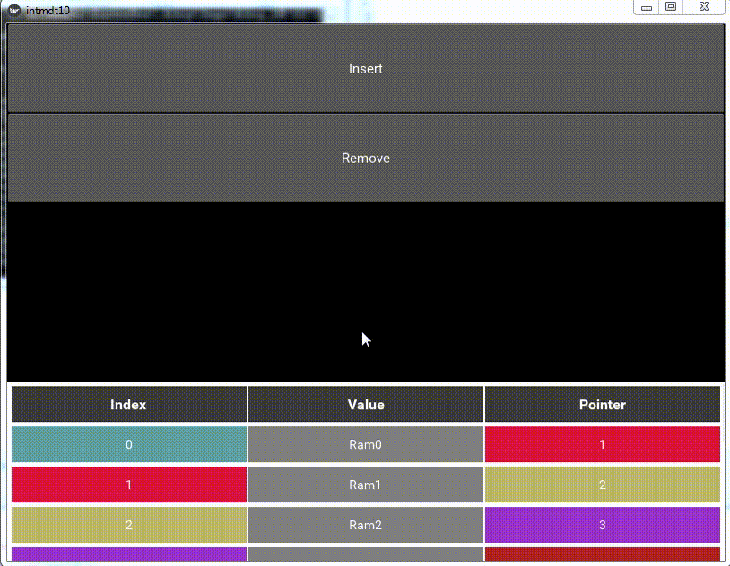
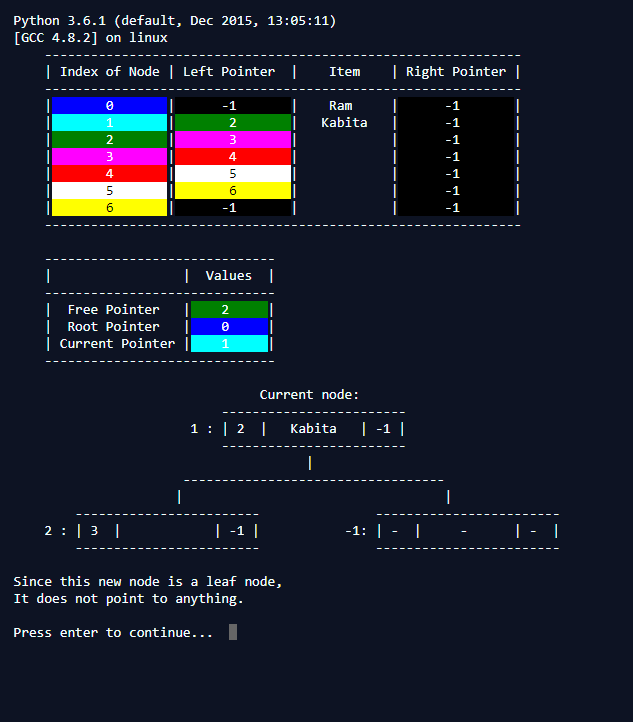

Link to introduction to project on YouTube: https://youtu.be/ThwKE4wxkCo

Link to an executable (that should hopefully work) for 64-bit Windows: https://drive.google.com/open?id=17QmOIxYPm57fvy2MuyIBAwE9zY22_Qr-

The framework being worked here is meant to allow extending algorithms written as normal programs to control the walk-through produced in the application. The function containing the algorithm's code is passed as an argument to a class which runs the function on a
new thread so that the program execution can be frozen. This is achieved through a slowly-looping infinite loop which terminates only when a signal is received telling the program that the program execution should crawl forward. (There probably is a better alternative that I don't know of yet) This allows the program to be run bit by bit. Other functions passed as arguments to the algorithm's function control display elements and the freezing. Special data object are used instead of or together with program variables as changes to these data objects reflect in the GUI.

See it in action for the insertion sort algorithm:

Here's what the code implementation of an algorithm explainer might look like.

-----------------------
log("Explanation text") 

log("Some more explanation text")

light([1,2,3]) """Highlight lines 1,2 & 3 in the pseudocode"""

"""Perform some action in program code, eg: self.dataStructure.setValue("Item", 0, "Ram")"""

lock() """Freeze the function at this point and update visuals, once user gives the go, unfreeze the function and continue"""

-----------------------

See insertion_sort.py to see all the code relevant to implementing it

The GUI relies on the Kivy framework.
The framework I implemented to freeze algorithms and control their behavior is iimplemented much differently here than in the CLI version preceeding it (see below)

Notice how the color-coding allows linking Pointers and Index, making it easier to keep up with linked-lists.

Freezing the code works by temporarily setting up a slowly looping infinite loop, the whole function runs on its own thread
seperate from the one on which the rest of the program is running so the rest of the program does not freeze.

In order to modify the data items such that it shows on the GUI, objects within data.py are used. Widgets associated with variables,
data and pointers are tied to these data objects and by modifying the data tracked by these objects (e.g: self.dataStructure.setValue("Item", 0, "Ram")) the data displayed by the widgets can be altered.

These data objects are defined as properties of classes inheriting from the Operations class. The doUpdate and buildInternal methods of the Controller class are defined keeping in mind the Operations class used as a source for the controller. See controller.CustomController and insertion_sort.SortOp to see how the Operations and Controller class interact.

Question 6 at "https://papers.gceguide.com/A%20Levels/Computer%20Science%20(for%20final%20examination%20in%202021)%20(9608)/9608_s15_qp_41.pdf" 
should give you an idea of what kind of CS questions it's supposed to be helpful for.

Screenshot gif of previous CLI implementation below.

There the table shows data relevant to an algorithm (variable values, index values, items values, pointer values etc.)
The text below it tries to explain what is going to happen next in the algorithm. 

Notice how the colors of the cells (in the following gifs) change as the explanation moves forward.
Each index cell has a unique color and the color is the same across index and pointer columns. 
This was intended to make it easier to follow the changes to pointers and index values.

The command line version project requires the colorama library to work.
Run it through CLI/main.py. It uses a clear screen function which 
only seems to work when running the program on a command line so it'll be best to 
view there. The function is different for the repl.it version which is linked below.

Run the command line version on browser: https://repl.it/@OverCky/ADT-Wise

Screenshots from the command line version on repl.it:

