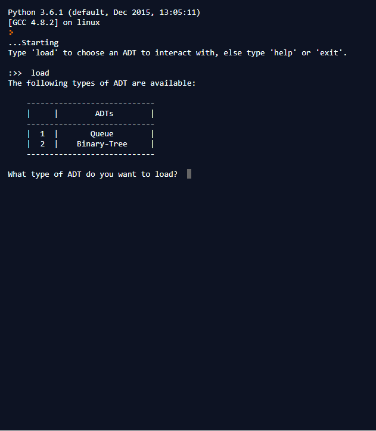

Run on browser: https://repl.it/@OverCky/ADT-Wise

The project requires the colorama library to work.
Run it through main.py. It uses a clear screen function which 
only works when running the program on a console so it'll be best to 
view there.

Screenshots from the version on repl.it:

So far I've completed the log texts for Queue and Binary-Tree only.
I hope to get other ADTs included in time.

---------------------------------------

If you want to contribute, feel free to tinker with the log texts for the
other ADTs (hash-table, stack, linked-list) and register them in adt_logic.

Refer to adt_queue to look at how self.refresh() and self.post() are being used
for implementing the live log.
